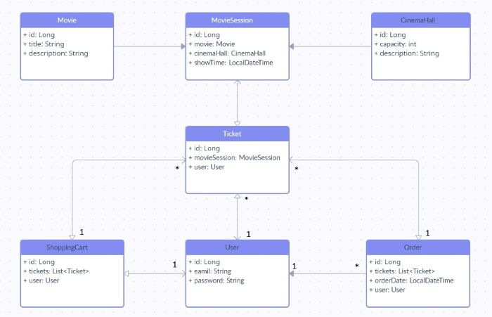

# ****Cinema App Project**** #

## 🚀 Description
This application is look like a simple visualisation of small Cinema app.
Users: You can register a new account as USER, login, work or logout later.
Cinema: There are different cinema-halls, movies and movie-sessions with different time and parameters.
Orders: Users can place orders through the shopping cart, pre-generated tickets with movie-sessions.

## 🚀 Project structure
**The project has an N-Tier Architecture**
- Controller - This level allows the user to work with this application.
- Service - This level of architecture is responsible for processing the data received from the DAO level.
- DAO - This level of architecture is responsible for communicating with the database.
- MySQL database.
- DB diagram:



## 🚀 Features
- Registration
- Authentication
- Login / Logout
- Set role for each user (by default USER)
- ADMIN can create and delete movies and movie sessions
- USER can buy a ticket for the movie session
- Access configuration by HTTP methods and Role
``` java
    POST: /register - all
    GET: /cinema-halls - user/admin
    POST: /cinema-halls - admin
    GET: /movies - user/admin
    ...
```

## 🚀 Technologies
- Java 11
- Maven
- MySQL
- Tomcat
- Hibernate
- Spring Web/Security

## 🚀 Quickstart
1. Fork this repository
2. Copy link of project
3. Create new project from Version Control
4. Edit resources/db.properties - set the necessary parameters
``` java
    db.driver=YOUR_DRIVER
    db.url=YOUR_URL
    db.user=YOUR_USERNAME
    db.password=YOUR_PASSWORD
```
5. Create the necessary name of DB
6. Install Tomcat
7. Add Tomcat server to configuration and Fix it.
8. Run project

## 🚀 Example of parameters for db.properties
``` java
    db.driver=com.mysql.cj.jdbc.Driver
    db.url=jdbc:mysql://localhost:3306/NameOfDataBase?useUnicode=true&serverTimezone=UTC
    db.user=root
    db.password=123456
```
